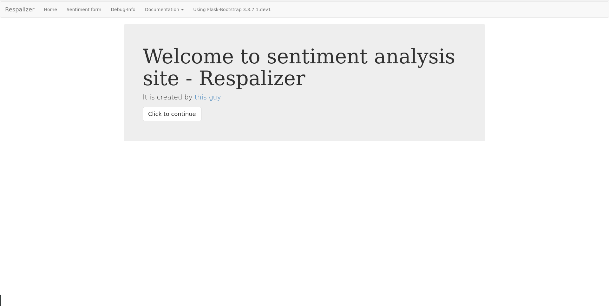
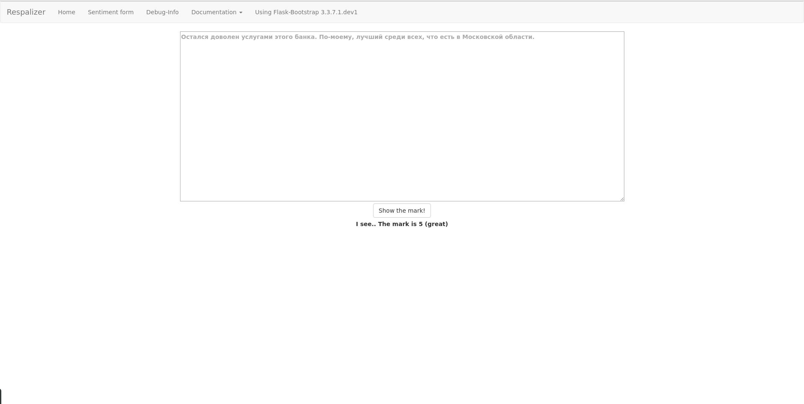

# Respalyzer (c)
Russian sentiments analyzer.  
Predicts tonality of response - mark from 1 to 5.

Supported topics:
- Bank services responses
- (TODO) Films
- (TODO) Tweets

(This project originally was a homework for <a href="https://github.com/vkantor/MIPT_Data_Mining_In_Action_2016">"Data Mining in Action 2016" MIPT course</a>)

# How to run it?

1. Download this repo:  

<code>git clone https://github.com/izaharkin/Respalyzer</code>

2. Install the dependencies:

<code>pip install -r requirements.txt</code>

**Note:** It is highly recommended to use virtual envirenment, e.g. `conda env` or `virtualenv`

3. Go to `Respalizer/` folder and run the script:  

<code>python run.py</code>

The application will be available on `127.0.0.1:5000` in any browser.
